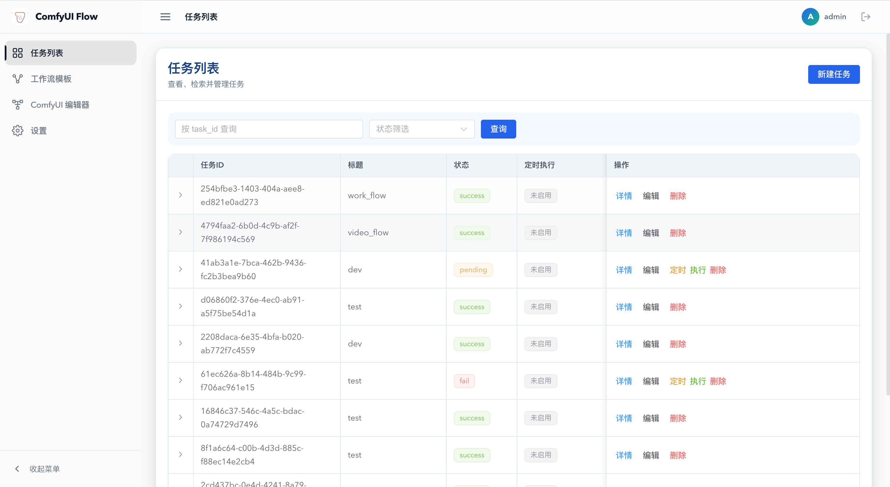
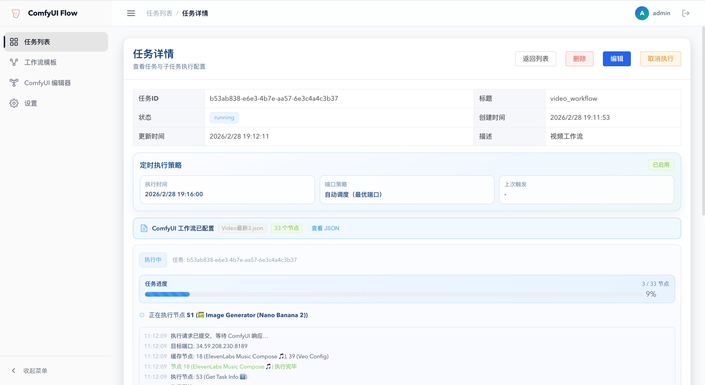

# ComfyUI Flow Task Manager
**把重复的工作交给代码，把创意留给人类**

*一个为 ComfyUI 量身打造的高级工作流管理与自动化调度平台*

---

## 📌 简介 (Introduction)

**ComfyUI Flow Task Manager** 是一个自动化、集中化的任务管理界面系统，旨在解决多模型大批量 AI 出图时的管理混乱和长期蹲守执行等痛点。它拥有极富科技感的现代化用户界面。

通过这个平台，你可以：
* 将基于 ComfyUI API 的 JSON 工作流保存为云端的 **工作流模板 (Templates)**，通过参数快速调起。
* 设计 **批量并发子任务**，脱离手动单次点击的烦恼。
* 通过内置的 **Cron 定时器** 安排未来的生成工作。下班前设好，早上来看结果。
* 实时追踪节点执行动态，错误和图像产出一目了然。
* 以全屏内嵌的方式沉浸式调度原生的 ComfyUI 画布与插件生态。

## 🚀 核心特性 (Features)

* 🎨 **极简而华丽的现代 UI**：设计感十足的炫酷首页、响应式 Dashboard 与流畅的微动效反馈。
* 🛠 **工作流模板库**：支持上传你的流程模型，配置参数并复用，支持版本追溯，无需反复操作接线。
* ⏱️ **智能调度与定时执行**：基于队列后台全自动管理任务状态控制；支持设定未来时刻执行生图。
* 📦 **批量生成集群**：提供灵活的子任务表单配置；通过选择模型参数、定制提示词实现一次配置多重衍生。
* 🛡️ **内嵌官方编辑器**：可在系统中同屏加载原版 ComfyUI 进行工作流调试，再将其下发系统。
* 🔧 **健壮的技术栈**：基于 FastAPI 和 Vue 3 的异步架构设计，支撑长时间、高负载的图像生成请求。
* 🔌 **无缝 WebSocket 连接**：直连 ComfyUI 内部日志中心，在系统的任务追踪面板上直接阅读算力节点的运算进展及进度条。

## 📸 界面预览 (Screenshots)

> **注**：请将以下占位符 URL 替换为实际的应用截图。项目中可将截图放入 `docs/screenshots/` 目录下。

### 炫酷着陆页 (Landing Page)

### 主控制台与状态图表 (Dashboard & Status)

### 工作流配置与批量参数 (Template Configuration)

### 任务追踪与 ComfyUI 原生内嵌 (Task Tracking & Embedding)

## 💻 技术栈架构 (Tech Stack)

该项目采用前后端分离的开发架构构建：

- **后端 (Backend)**: 
  - 核心框架：[FastAPI](https://fastapi.tiangolo.com/) (Python 高并发处理能力)
  - 数据库与迁移：PostgreSQL + SQLAlchemy 2.0 + Alembic
  - 核心特权管理：JWT 鉴权机制
  - 进程保活方案：Python 原生 `asyncio` 与队列调度器
- **前端 (Frontend)**:
  - 核心框架：[Vue 3](https://cn.vuejs.org/) (Composition API) + [Vite](https://vitejs.dev/)
  - 组件库与状态管理：[Element Plus](https://element-plus.org/) + Pinia
  - 图形与动画动效：原生 Canvas / Three.js 异步支持

## 📖 部署与启动 (Deployment)

如果你想在你的 Linux 或本地服务器上部署该平台，请参阅随附的完整部署指南。内含如何初始化数据库、配置 Nginx 代理及部署后台服务（systemd）。

👉 [**查看完整的部署指南文档 (Deploy.md)**](./deploy.md)
